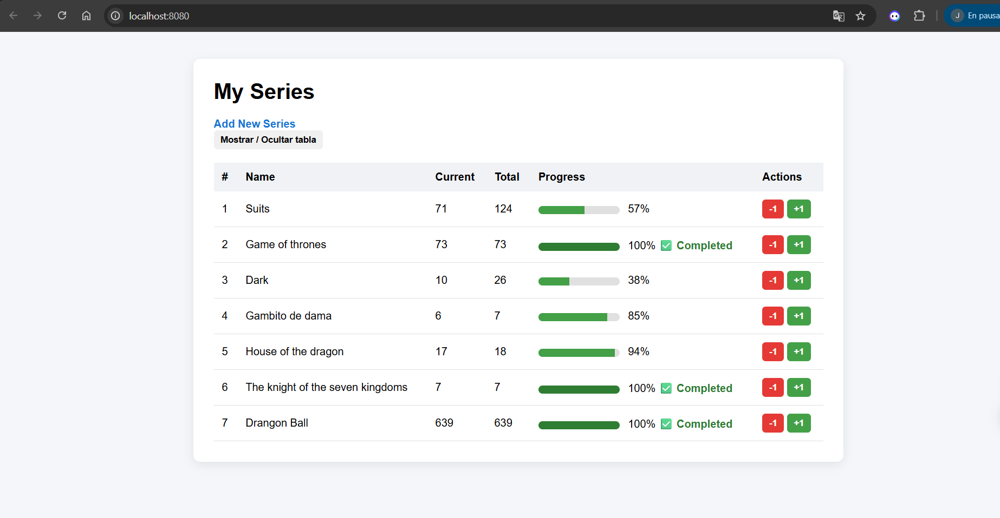

# Series Tracker — Lab 5 (Server Side Rendering)

## 📌 Descripción

Series Tracker es una aplicación web desarrollada en Go que permite llevar el control de series vistas.  
El proyecto implementa **Server Side Rendering (SSR)** utilizando un servidor HTTP crudo (sin `net/http`) y una base de datos SQLite.

Este laboratorio demuestra dos mecanismos fundamentales de la web:

- Formularios HTML tradicionales con `POST`
- Comunicación moderna usando `fetch()` desde JavaScript

---

## 🚀 Tecnologías utilizadas

- Go (servidor HTTP crudo con `net`)
- SQLite
- HTML5
- CSS3
- JavaScript (fetch API)
- modernc.org/sqlite (driver)

---

## ⚙️ Cómo ejecutar el proyecto

1. Asegurarse de tener Go instalado.
2. Clonar el repositorio.
3. En la carpeta del proyecto ejecutar: go run main.go

---
## 🧩 Funcionalidades implementadas

### ✔ Página principal (/)

- Renderizado dinámico desde SQLite.
- Tabla con todas las series.
- Barra de progreso visual.
- Indicador **"Completed"** cuando la serie está finalizada.
- Botones **+1** y **-1** para actualizar episodios.

---

### ✔ Crear nueva serie (/create)

- Formulario HTML tradicional.
- Método `POST`.
- Inserción en SQLite.
- Redirección con `303 See Other` (POST/Redirect/GET).

---

### ✔ Actualización dinámica con fetch()

- Botón **+1** usando `fetch()` con método `POST`.
- Botón **-1** usando `fetch()`.
- Rutas `/update` y `/decrement`.
- Actualización protegida contra límites.

---

### ✔ Validaciones en servidor

Se implementaron validaciones backend para:

- Nombre no vacío.
- Episodio actual >= 1.
- Total de episodios >= 1.
- Episodio actual no mayor al total.
- Conversión segura de tipos.
- Protección contra datos inválidos.

El servidor responde con `400 Bad Request` si la validación falla.

---

## 🏆 Challenges implementados

Los siguientes challenges fueron completados:

- ✅ Estilos y CSS personalizados.
- ✅ Código go ordenado
- ✅ Código JavaScript organizado en archivo separado (`script.js`).
- ✅ Barra de progreso visual.
- ✅ Texto especial cuando la serie está completa.
- ✅ Botón -1 para disminuir episodio.
- ✅ Validación en servidor.
- ✅ Diseño mejorado (layout centrado, botones estilizados, hover effects).

## Captura de pantalla de servidor corriende

